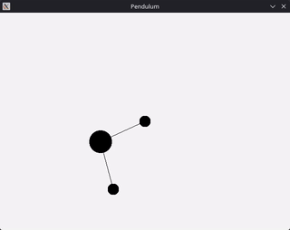

# fizz - A PBD, 2D physics library
### Note: This library is a work in progress; expect bugs and peculiar behavior
fizz is a physics library that leverages a traditional Verlet integrator for superior energy conservation and numerical stability.




## Features:
- Dynamic and Kinematic bodies
- Spring constraints
- Distance constraints
- Decoupled rendering via callbacks
- (WIP) Python wrapper

## Building the examples:
### Requirements:
- C++20 compiler
- CMake 3.30+

```
cd fizz
cmake -S . -B build -DBUILD_FIZZ_EXAMPLES=ON
cmake --build build
```

## Using the library:
```cmake
# CMakeLists.txt
add_subdirectory(fizz)
target_link_libraries(YourTarget PRIVATE fizz)
```
Refer to `examples/pendulum` for a basic example.